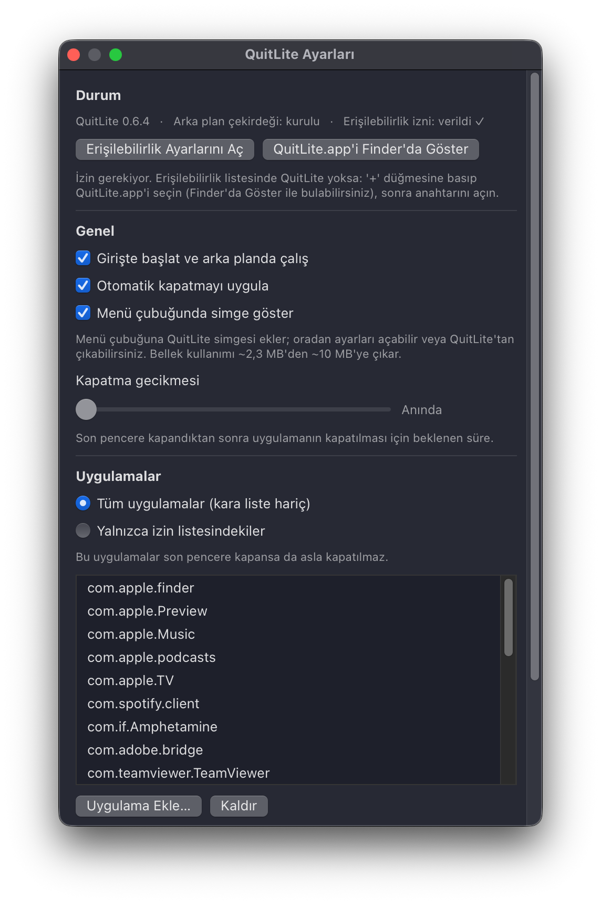
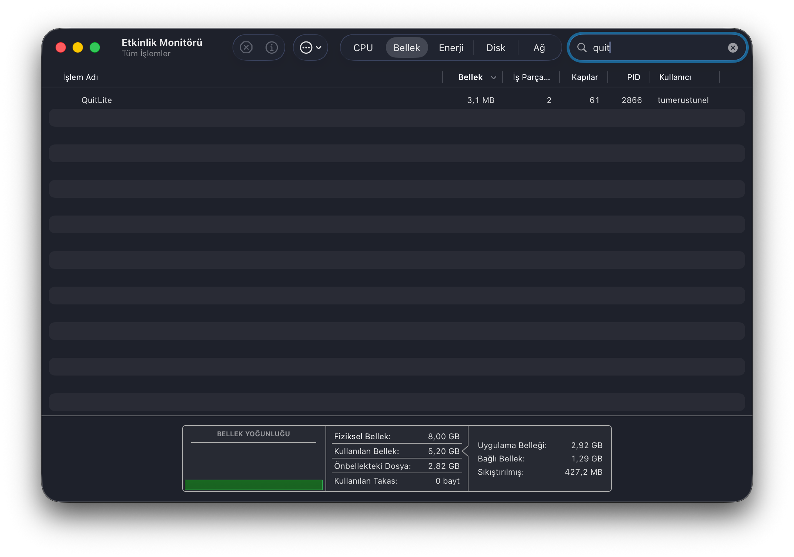

# QuitLite

**Bir uygulamanın son penceresini kapat — QuitLite uygulamayı senin için kapatır. Yaklaşık 3 MB RAM ile.**


[](https://github.com/Tumelo00/QuitLite/releases/latest)

*Read this page in [English](README.md).*



QuitLite, aşırı hafif bir macOS arka plan aracıdır. Bir uygulamanın son
penceresini kapattığında, QuitLite o uygulamayı sessizce kapatır — böylece
ekranda hiçbir penceresi olmadan arka planda çalışan uygulama kalmaz.

Gömülü yazılım (firmware) gibi tasarlandı: küçük, sessiz ve haftalarca kararlı.
Dock simgesi yok, kendine ait penceresi yok, gürültüsü yok — yalnızca yaklaşık
**3 MB RAM** kullanan bir arka plan yardımcısı.

## Özellikler

- **Otomatik kapatma** — bir uygulamanın son penceresi kapandığında QuitLite onu
  kapatır.
- **Kara liste veya izin listesi** — hariç tuttukların dışındaki tüm uygulamaları
  yönet ya da yalnızca seçtiklerini.
- **Ayarlanabilir gecikme** — kapatmadan önce 0–30 saniyelik bir bekleme süresi.
- **Güvenilir algılama** — kapatınca pencereyi yok etmeyip yalnızca gizleyen
  uygulamalarla doğru çalışır; minimize pencereleri "açık" sayar.
- **Yanlış kapatma koruması** — gecikme ve çift doğrulama, normal pencere/masaüstü
  geçişlerinde uygulamanın yanlışlıkla kapatılmasını önler.
- **İsteğe bağlı menü çubuğu simgesi** — ayarlara menü çubuğundan ulaş ya da
  QuitLite'tan çık.
- **Universal** — hem Apple Silicon hem Intel Mac'lerde native çalışır.
- **Gizli ve çevrimdışı** — telemetri yok, analiz yok, ağ erişimi yok. Hiç.

## Tasarımı gereği hafif



QuitLite'ın arka plan yardımcısı yaklaşık **3 MB RAM** ve çok düşük CPU ile
çalışır. Pencereyi kapattığında hızlı tepki verir, yine de 7/24 açık kalıp
pile yük bindirmeyecek kadar hafif kalır.

## Kurulum

1. `QuitLite.dmg`'yi
   [en son sürümden](https://github.com/Tumelo00/QuitLite/releases/latest) indir.
2. DMG'yi aç, **QuitLite**'ı **Applications** kısayoluna sürükle.
3. `QuitLite`'ı Uygulamalar klasöründen aç. QuitLite ücretli bir Apple Developer
   sertifikası olmadan dağıtıldığı için macOS ilk açılışta engeller — yalnızca
   bir kez izin vermen gerekir:
   - **macOS 15+:** Sistem Ayarları → Gizlilik ve Güvenlik → aşağı kaydır →
     "QuitLite engellendi" → **Yine de Aç**.
   - **Eski macOS:** QuitLite'a sağ tık → **Aç** → **Aç**.
   - DMG ayrıca bu adım için şeffaf bir yardımcı betik içerir:
     `Open_If_macOS_Blocks.command`.
4. İstendiğinde **Erişilebilirlik** iznini ver (Sistem Ayarları → Gizlilik ve
   Güvenlik → Erişilebilirlik) — QuitLite pencere kapanışlarını algılamak için
   buna ihtiyaç duyar.

Her sürüm bir `QuitLite.dmg.sha256` sağlama toplamı içerir; indirmeyi
doğrulamak için: `shasum -a 256 -c QuitLite.dmg.sha256`.

## Kullanım

Ayarları değiştirmek için `QuitLite`'ı istediğin zaman aç: kara liste/izin
listesi modunu seç, uygulamaları belirle, kapatma gecikmesini ayarla ya da menü
çubuğu simgesini aç/kapat. Pencereyi kapattığında QuitLite arka planda sessizce
çalışmaya devam eder. Girişte otomatik başlar.

## Kaldırma

QuitLite'ı aç ve **"QuitLite'ı Bilgisayardan Kaldır"** düğmesine bas. Her şeyi
temizce kaldırır — arka plan yardımcısı, girişte başlatma, tüm ayarlar ve
önbellek — ve uygulamayı Çöp'e taşır. İz bırakmaz.

## Gereksinimler

macOS 13 (Ventura) veya üzeri. Apple Silicon ya da Intel.

## Kaynaktan derleme

```bash
./build.sh
```

`QuitLite.app` ve dağıtıma hazır, universal bir `QuitLite.dmg` üretir. Swift 5.9+
ve Xcode komut satırı araçları gerekir.

## Lisans

[MIT](LICENSE)
